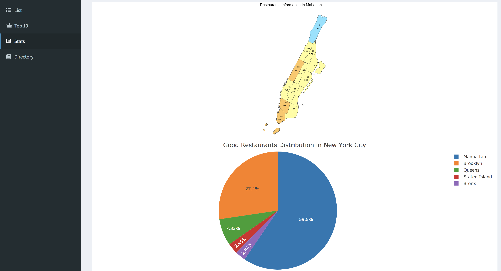

# Project 2: Shiny App Development Version 2.0

### [Project Description](README.md)





In this second project of GR5243 Applied Data Science, we develop a version 2.0 of an *Exploratory Data Analysis and Visualization* shiny app on a topic :NYC Tour Guide Application, which using [NYC Open Data](https://opendata.cityofnewyork.us/) and  restaurant-related data crawled from Yelp. 

The **learning goals** for this project is:
- shiny app development for practical daily tool


## NYC Tour Guide: a shiny app for travel plan
Term: Fall 2019

+ Shiny App Link: https://yexuanhong.shinyapps.io/proj2_final/
+ Team members
	+ Cho, Sung In: sc4393@columbia.edu
	+ Li, Yanan: yl4062@columbia.edu
	+ Qiang, Runzi: rq2156@columbia.edu (Presenter)
	+ Ye, Xuanhong: xy2387@columbia.edu
 

+ **Project summary**: In this second project of GR5243 Applied Data Science, we built a demo app to provide users suggestions in the choice of scenic spots when visiting New York City. Based on shiny app projects conducted by group 8 (Spring 2019), we have updated our datasets with newly classified, such as restaurants, museums and theatres, and organized to display various business information in a data table and to visualize the places in maps to further enhance users' experience.

+ **Contribution statement**: All team members contributed equally in all stages of this project. All team members approve our work presented in this GitHub repository including this contributions statement. 

	+ Data Cleaning
		+ Cleaned and formalized landmarks, filming site, restaurants, libraries, and museum datasets: 
		   yl4062, xy2387

	+ UI Design
		+ Created the five-page frame: sc4393
		+ Welcome page UI: xy2387, sc4393
		+ Stats and Direcotry page UI: rq2156
		
		
	+ Server - Map Page   :  sc4393, xy2387
		
	+ Server - List Page  : sc4393, xy2387
		
	+ Server - Top 10 Page : sc4393
		
		
	+ Server - Stats Page : yl4062, rq2156
		
		
		
	+ Server - Directory Page : yl4062, rq2156
		
		
	+ Publish: xy2387
		
	
+ **Reference**: We used part of the codes from [group 8 (Spring 2019)](https://github.com/TZstatsADS/Spring2019-Proj2-grp8) as reference.

Following [suggestions](http://nicercode.github.io/blog/2013-04-05-projects/) by [RICH FITZJOHN](http://nicercode.github.io/about/#Team) (@richfitz). This folder is orgarnized as follows.


```
proj/
├── app/
├── lib/
├── data/
├── doc/
└── output/
```

Please see each subfolder for a README file.

